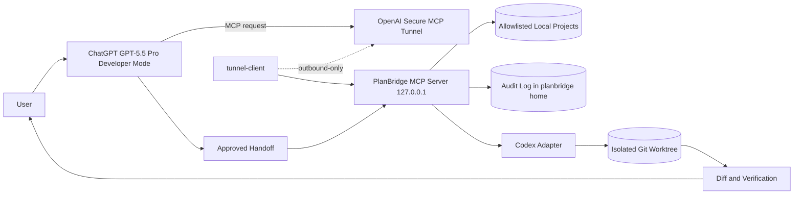

# PlanBridge Product and Technical Spec

> **Spec version:** v1.0 (2026-06-16). This document is the frozen build contract
> for milestone M1. The grading source for the builder is the per-milestone
> a per-milestone frozen acceptance spec; this spec is the
> contract source. Platform facts
> in [Section 15](#15-assumptions-and-dependencies) were verified on 2026-06-16
> and must be re-verified before build.

## 1. Executive Summary

PlanBridge is a local MCP connector that lets ChatGPT use GPT-5.5 Pro as a
planner over an allowlisted developer workspace, then hands the approved plan to
Codex for execution. The goal is not to replace Codex. The goal is to add a
high-quality planning and review gate before long-running Codex work while
preserving subscription-mode usage, local workspace control, and explicit human
approval.

The **primary, durable value** is planning quality plus a safe, auditable
handoff: GPT-5.5 Pro plans over real repo context behind a narrow read-only
boundary, and only human-approved text reaches Codex. A **secondary,
non-guaranteed benefit** — extra effective daily throughput from ChatGPT and
Codex billing against separate usage meters — is documented honestly in
[Section 4.1](#41-secondary-benefit-and-its-limits) but is never the product's
reason to exist.

## 2. Problem Statement

### Who has this problem?

Power users who rely on Codex for implementation but want GPT-5.5 Pro's stronger
planning, research, and architectural judgment before a coding agent starts
changing files.

### What is the problem?

GPT-5.5 Pro planning is useful in ChatGPT, but Codex execution lives in a
separate local-agent surface. Manually copying repo context into ChatGPT and
copying plans back into Codex is slow, lossy, and easy to do inconsistently.

### Why is it painful?

- Complex plans often fail because the planner did not see the relevant repo
  files, constraints, tests, or local conventions.
- Codex can execute quickly, but execution quality depends on the handoff
  prompt. Weak handoffs waste subscription limits and create review churn.
- API-key workarounds can turn a subscription workflow into an API-billed one.
- Exposing local development context to a hosted model has real security risk if
  the boundary is not narrow and inspectable.

## 3. Target Users and Jobs

### Primary Persona: Agent Power User

- Runs Codex, Claude Code, or similar agents on local projects.
- Wants a high-quality plan before giving an agent hours of autonomy.
- Cares about subscription limits, local security, and repeatable handoffs.
- Sharpest trigger: a **heavy daily Codex user** working on **ambiguous,
  cross-module** tasks who is **quota-conscious** and has been burned by a fast
  agent executing a weak plan.

### Secondary Persona: Solo Builder With Many Projects

- Juggles several projects and wants ChatGPT to inspect enough local context to
  plan correctly.
- Wants a guided setup wizard rather than hand-editing MCP config.

### Jobs To Be Done

- When a task is complex, produce a better implementation plan from live repo
  context before Codex starts coding.
- When ChatGPT finishes planning, hand a compact, constrained goal to Codex
  without manual copy/paste.
- When a connector is reachable by a hosted model, expose only safe tools and
  auditable file access.

## 4. Strategic Context

PlanBridge is valuable only if it creates a measurable planning-quality lift for
complex work. It should not become a general shell bridge from ChatGPT to the
machine.

The strategic bet is that GPT-5.5 Pro is most useful as an architect/reviewer
for ambiguous or cross-module tasks, while Codex remains the better local
execution worker. The product should make that separation explicit.

### 4.1 Secondary Benefit and Its Limits

Because ChatGPT planning consumes ChatGPT subscription usage and Codex execution
consumes Codex usage, splitting planning out of Codex can extend effective daily
throughput for heavy users — an observed quirk of separate OpenAI usage meters,
which the origin author hedges as "apparently". Treat this as a **non-guaranteed
secondary benefit**: OpenAI may unify usage accounting at any time, which would
remove the headroom without affecting the planning-quality value. PlanBridge is
positioned on planning quality and safe handoff, not on quota arbitrage (see the
[Section 14](#14-out-of-scope-for-mvp) non-goal).

### 4.2 Positioning Honesty

PlanBridge is a thin connector around models and an agent it does not own. Its
only defensible value is the **safety boundary** (allowlist, redaction, audit,
worktree-isolated handoff) and **handoff quality** — invest there, not in
surface area. The clearest platform risk is the one the origin's quoted tweet
names directly: OpenAI shipping GPT-5.5 Pro planning natively inside Codex, which
would collapse the core need. Build accordingly: keep the MVP cheap to abandon.

## 5. Product Name

**PlanBridge**

Rationale: the product bridges a plan from GPT Pro in ChatGPT into Codex. It is
plain enough to remember, describes the utility directly, and avoids depending
on the leaked prototype name.

## 6. Solution Overview

### Core Flow

1. User runs `planbridge setup`.
2. Setup records an allowlisted projects root, a local bind port, and a
   **connection**: either an OpenAI Secure MCP Tunnel `tunnel_id` (recommended)
   or a public HTTPS base URL from a user-managed tunnel (ngrok/Cloudflare).
3. User adds the PlanBridge MCP connector in ChatGPT **Developer Mode**
   (Settings → Connectors → Advanced → Developer Mode), choosing **Tunnel** and
   the PlanBridge tunnel, or pasting the public connector URL.
4. In ChatGPT, GPT-5.5 Pro uses PlanBridge tools to inspect allowed repo context.
5. GPT-5.5 Pro produces a plan or critiques an existing one.
6. User explicitly invokes `codex_handoff`.
7. PlanBridge writes the approved handoff artifact and, via a subscription-mode
   Codex adapter, starts or queues Codex execution in an isolated worktree.
8. User monitors Codex status and reviews verification evidence.

### Connection Model (verified 2026-06-16; re-verify before build)

PlanBridge serves **Streamable HTTP** (the current default for the official
TypeScript MCP SDK) and binds to `127.0.0.1` on the configured port. The
connector URL is `<origin>/mcp`. Two connection paths are supported:

- **Recommended — OpenAI Secure MCP Tunnel.** `tunnel-client` opens an
  **outbound-only** HTTPS connection to OpenAI and forwards queued MCP requests
  to the local server. There is **no public inbound endpoint**, which removes
  the "public MCP endpoint discovered" attack surface by construction. The user
  selects the tunnel by `tunnel_id` in ChatGPT connector settings.
- **Fallback — user-managed public tunnel** (ngrok / Cloudflare Tunnel). A
  public HTTPS origin maps to the local server. This path *does* expose a public
  endpoint and therefore requires the network hardening in
  [Section 9](#9-security-requirements).

> Transport note: SSE (`/sse`) is the legacy ChatGPT MCP transport and would
> change the URL path. Streamable HTTP is the frozen default; re-verify the
> chosen transport against current OpenAI MCP docs before the first build.

### Architecture



### Components

| Component | Responsibility |
|---|---|
| Setup CLI | Configure projects root, allowlist, bind port, connection, and access control; write validated config. |
| MCP Server | Serve Streamable HTTP, expose safe repo-inspection and handoff tools, enforce the security boundary on every call. |
| Project Index | Discover allowlisted repos and derive names, paths, languages, key docs, and check commands. |
| Context Packer | Build a bounded, redacted, **reproducible** repo context bundle for GPT-5.5 Pro (see [7.3](#73-context_pack-artifact-format)). |
| Codex Adapter | Hand the approved handoff to Codex in subscription mode, report mode and status (see [Section 8](#8-subscription-first-execution)). |
| Audit Log | Record metadata-only tool calls, paths, decisions, redactions, and handoffs (see [9.3](#93-audit-log-as-a-security-artifact)). |
| Status View | Show connector health, connection state, recent handoffs, and safety warnings. |

## 7. MCP Tool Surface

MVP tools are read-only except the explicit `codex_handoff` action. Each tool is
delivered at its **owning milestone**; appearing in this table does not mean it
ships in M1.

| Tool | Mode | Milestone | Purpose |
|---|---|---|---|
| `projects_list` | read-only | M1 | List allowlisted projects and basic metadata. |
| `project_summary` | read-only | M1 | Return repo type, key docs, scripts, test commands, and recent status. |
| `repo_search` | read-only | M1 | Search allowed files with bounded ripgrep-style results. |
| `repo_read_files` | read-only | M1 | Read specific allowed files with size limits and secret filtering. |
| `context_pack` | read-only | M2 | Package selected files, prompt, and constraints into a reproducible planning bundle. |
| `git_status` | read-only | M2 | Show branch and dirty-state summary. |
| `codex_handoff` | explicit action | M3 | Start or queue Codex execution from the approved plan. |
| `git_diff` | read-only | M4 | Show bounded diff for user/Codex review. |
| `codex_status` | read-only | M4 | Report running/completed handoff state. |

Do not ship these in MVP at any milestone: arbitrary shell, unrestricted file
read, write file, credential read, browser automation, package install, git
push, deployment, live service restart.

### 7.1 Tool Contracts

Every tool input is validated by a Zod schema. Numeric bounds reference the one
[Limits and Budgets](#72-limits-and-budgets) table — they are not re-hardcoded
here. M2–M4 tools are stubbed by name only in M1.

**Shared response envelope** (every list/search/read tool returns one of):

```ts
type Bounded<TKey extends string, TItem> = {
  [K in TKey]: TItem[];
} & { truncated: boolean; next_cursor?: string; total_estimate?: number };
```

**Shared error envelope** with a closed code enum:

```ts
type ToolError = { error: { code: ErrorCode; message: string; path?: string } };
type ErrorCode =
  | "E_PROJECT_NOT_ALLOWED"  // project not in the allowlist
  | "E_PATH_TRAVERSAL"        // path escapes the project root
  | "E_SECRET_BLOCKED"        // path matches the secret denylist
  | "E_GITIGNORED"            // path excluded by .gitignore
  | "E_SIZE_EXCEEDED"         // hard size/budget cap hit
  | "E_NOT_FOUND"             // path does not exist
  | "E_HANDOFF_INCOMPLETE";   // codex_handoff missing a required field
```

Secret and ignored paths return a **structured error** (`E_SECRET_BLOCKED` /
`E_GITIGNORED`) with no content — never a silent redaction — so Story 2's "clear
errors" criterion is testable.

**M1 tool I/O:**

```ts
// projects_list
input:  {}
output: { projects: Array<{ name: string; path: string; languages: string[] }>;
          truncated: boolean }

// project_summary  (derivation rules: heuristic, may evolve)
input:  { project: string }
output: { name: string; repoType: string; keyDocs: string[];
          testCommands: string[] | null; recentStatus: string }

// repo_search
input:  { project: string; query: string; glob?: string;
          maxResults?: number; maxMatchPreviewBytes?: number }
output: { matches: Array<{ path: string; line: number; preview: string }>;
          truncated: boolean }

// repo_read_files
input:  { project: string; paths: string[] /* max maxFilesPerRead */;
          maxBytesPerFile?: number }
output: { files: Array<{ path: string; bytes: number; truncated: boolean;
            content: string }>;
          blocked: Array<{ path: string; reason: ErrorCode }> }
```

Derivation rules for `project_summary` and `repo_search` (heuristic, may evolve):

- `repoType` from the presence of `package.json` / `pyproject.toml` /
  `Cargo.toml` / `go.mod`.
- `keyDocs` = `README.md`, `AGENTS.md`, `CLAUDE.md` when present.
- `testCommands` = `package.json` scripts matching `/^(test|check|lint)/`, else
  `null`.
- `recentStatus` = `git log -1 --format=...` plus a `git status --porcelain`
  summary.
- `repo_search` shells out to **ripgrep** (a required runtime dependency) with
  filter precedence: allowlist → secret denylist → `.gitignore` → glob.

### 7.2 Limits and Budgets

Single source of truth. Every Zod schema and every test references these names;
no other section restates the numbers. All defaults are overridable in config.

| Name | Default | Applies to |
|---|---|---|
| `maxBytesPerFile` | 64 KiB | `repo_read_files`, `context_pack` per-file |
| `maxFilesPerRead` | 20 | `repo_read_files` (per call) |
| `maxFilesPerSession` | 200 | total files read per MCP session (mass-read cap) |
| `maxContextBytes` | 512 KiB | `context_pack` total bundle |
| `maxSearchResults` | 50 | `repo_search` |
| `maxMatchPreviewBytes` | 4 KiB | `repo_search` per-match preview |
| `maxDiffBytes` | 256 KiB | `git_diff` |
| `toolTimeoutMs` | 15000 | every tool call |

Defaults are builder-tunable within config. Tests assert default boundary
behavior: a file at/over `maxBytesPerFile` returns `truncated: true` (soft cap)
or `E_SIZE_EXCEEDED` (hard cap), and a bundle over `maxContextBytes` drops
lowest-priority files into `omitted` rather than truncating mid-file.

### 7.3 `context_pack` Artifact Format

`context_pack` is the planning centerpiece; its output is frozen and
**reproducible by construction**:

```ts
type ContextPack = {
  schema_version: string;
  project: string;
  commit_sha: string;        // resolved git commit the pack is pinned to
  generated_at: string;      // ISO-8601, informational only
  prompt: string;
  constraints: string[];
  files: Array<{ path: string; sha256: string; bytes: number;
                 truncated: boolean; content: string }>;  // lexical path order
  budget: { used_bytes: number; max_bytes: number };       // max_bytes from 7.2
  redactions: Array<{ path: string; reason: string }>;
  omitted: Array<{ path: string; reason: string }>;
};
```

Reproducibility contract: pin to a resolved `commit_sha`, sort `files` in lexical
path order, include a per-file `sha256`, and guarantee that the same
`(commit_sha, file set, budget)` yields a **byte-identical** pack except for the
informational `generated_at`. On budget overflow, drop lowest-priority files and
record them in `omitted` — never silently truncate the set.

### 7.4 `codex_handoff` Artifact Format

One canonical artifact, written by the `handoff-file` adapter and consumed by the
`codex-cli` adapter, so the two never diverge. Markdown with YAML frontmatter for
machine fields:

```markdown
---
schema_version: "1.0"
objective: "<one-line goal>"
project: "<allowlisted project name>"
non_goals: ["..."]
likely_files: ["..."]
verification: ["npm test", "..."]
stop_conditions: ["..."]
---

## Objective
...
## Context
...
## Constraints
...
## Verification
...
## Stop Conditions
...
```

`codex_handoff` **rejects** any handoff missing a required frontmatter field or
H2 section with `E_HANDOFF_INCOMPLETE`. Validating "includes all seven fields"
(Story 3) is therefore a schema check, not a prose promise.

## 8. Subscription-First Execution

Default posture: no OpenAI **model** API calls inside PlanBridge.

- ChatGPT planning consumes ChatGPT subscription usage.
- Codex execution uses a ChatGPT-authenticated Codex path. Verified 2026-06-16
  against live OpenAI docs (re-verify before build): Codex CLI authenticates with
  a ChatGPT account, an API key, or an
  access token; non-interactive subscription-mode invocation is possible via
  `codex login --with-access-token` reading a ChatGPT access token from stdin,
  then `codex exec` for a non-interactive run.
- API-key mode is out of scope for MVP unless explicitly enabled later.
- The adapter **must detect and report** whether Codex is running under
  ChatGPT-login auth (subscription) or an `OPENAI_API_KEY` (API-billed), and
  surface any switch to the user before execution.

The adapter interface and status enum are frozen now so M1 scaffolding does not
guess; the concrete `codex exec` invocation surface stays deferred to
[Open Q1](#16-open-questions):

```ts
interface CodexAdapter {
  mode(): "subscription" | "api-key";
  start(handoff: CodexHandoff): Promise<{ handle: string }>;
  status(handle: string): Promise<{
    state: "queued" | "running" | "completed" | "failed" | "requires-user-input";
    detail?: string;
  }>;
}
```

`handoff-file.start` writes the [7.4](#74-codex_handoff-artifact-format) artifact
and returns a file-path handle; it is the M3 default. `requires-user-input`
applies only if an interactive Codex mode is later used — a one-shot `codex exec`
run does not produce it.

**`codex-cli` adapter — verified mechanics (2026-06-17, re-verify before build).**
Open Q1 is resolved: non-interactive **subscription** execution is feasible. The
adapter creates a dedicated git worktree on a fresh branch from the approved
project, then spawns:

```
codex exec -c approval_policy="never" --cd <worktree> \
  --sandbox workspace-write --json -o <result-file> -
```

(the approved handoff text is piped to stdin via `-`). **Flag note (verified
2026-06-17 against codex-cli 0.139.0):** `-a`/`--ask-for-approval` is a *top-level*
`codex` flag, not an `exec` subcommand flag — `codex exec -a …` errors — so the
approval policy is set with the exec-level `-c approval_policy="never"` config
override. `never` (not `on-request`) is the headless choice: a non-interactive run
has no human to approve an escalation, and the real boundary is
`--sandbox workspace-write` + `--cd <worktree>`, not the approval prompt. Re-run
`codex exec --help` and confirm the form parses before build.

`codex exec` **reuses the operator's saved Codex CLI authentication by default**,
so when the operator is logged in with ChatGPT it runs in subscription mode. The
api-key switch for `codex exec` is **`CODEX_API_KEY`** (a non-empty `OPENAI_API_KEY`
is also treated as api-key for safety); either makes `mode()` report `api-key`, and
the adapter **refuses to spawn** in api-key mode (subscription-first). `--sandbox
workspace-write` confines working-tree *writes* to the worktree (`--cd`), realizing
§9.1 scope confinement (it does not confine reads — Codex's own egress and
in-worktree secret reads are accepted residual trust per §9.5; nor does it isolate
the project's **shared `.git`**, into which an in-worktree commit necessarily writes
its objects and the `planbridge/<run-id>` ref — a trusted-by-construction write
surface bounded by never-auto-merge + human diff review + the unchanged-main-HEAD
assertion, not by the sandbox); `--json` events
(`turn.completed`/`turn.failed`) plus the process exit code and
`--output-last-message` drive `status()`. The adapter bounds the run with a
configurable timeout and kills the process *group* on expiry (a one-shot
`codex exec` is not a long-lived addressable session; user-facing cancel/kill stays
M4/M5). OpenAI recommends API keys for unattended service accounts; PlanBridge's
single-logged-in-operator model uses the saved subscription auth deliberately.
Sources: [Codex non-interactive](https://developers.openai.com/codex/noninteractive),
[Codex CLI reference](https://developers.openai.com/codex/cli/reference),
[Codex auth](https://developers.openai.com/codex/auth).

## 9. Security Requirements

### 9.1 Required Controls

- **Project root allowlist.** No default access to `/Users`, home directories, or
  runtime homes. `~/.planbridge/` is itself on the path-deny list so PlanBridge's
  own config and tokens are never reachable through `repo_read_files`.
- **Path normalization and traversal blocking** (`../`, symlink escape, absolute
  paths) → `E_PATH_TRAVERSAL`.
- **Layered secret protection (M1 boundary):**
  1. Deny `.git/` entirely by default — history and packed blobs can contain
     secrets the working-tree denylist misses.
  2. Path denylist: `.env`, private keys, tokens, browser profiles, SSH material,
     keychains, credentials, auth caches, known runtime profile folders →
     `E_SECRET_BLOCKED`.
  3. Exclude `.gitignored` paths by default → `E_GITIGNORED`.
  4. A rule-based **content-scan redaction** pass over every returned byte that
     redacts high-entropy strings and known credential prefixes (`-----BEGIN`,
     `AKIA`, `sk-`, `ghp_`, `xox`) with a placeholder, recording each hit in the
     audit log. Binary, over-size, and lockfile content is summarized or refused,
     not returned raw.

  An optional readable-extension allowlist is a post-MVP tightening, not a
  required inversion. The content scanner is rule-based only — no ML, no external
  service.
- **Size and budget limits** per the [7.2](#72-limits-and-budgets) table.
- **Fail-closed auth boundary.** The tunnel-/public-facing transport **refuses to
  start, and setup refuses to print the public connector URL, when no access
  control is configured.** A localhost-only mode may run tokenless for local
  testing. A continuous self-probe **hard-alerts** (not merely warns) if the
  public path is reachable without the configured control. This control is pulled
  into **M1**, not deferred to M5.
- **Network hardening for the public-tunnel fallback.** The access-control secret
  is ≥256-bit CSPRNG output, compared in constant time, never logged
  (`Authorization` headers redacted from audit and stdout); the public base URL
  MUST be HTTPS (setup rejects non-HTTPS); auth failures are rate-limited with
  backoff and a lockout threshold. The tunnel provider terminates TLS and is
  inside the trust boundary (accepted residual trust). This stays single-user —
  no OAuth/SSO escalation.
- **Worktree-isolated Codex execution.** `codex_handoff` runs in a dedicated git
  worktree on a fresh branch — never directly in the live working tree (reusing
  the estate's mandated worktree-isolation pattern for write-capable agents).
  Writable scope is confined to the single approved project path; out-of-scope
  targets are rejected. The human approves the **exact verbatim handoff text**
  (the same bytes sent to Codex); tool output is never forwarded to Codex
  unreviewed. Each handoff requires its own approval — no implicit re-runs. A
  cancel/kill control is deferred to M4/M5 (it needs a long-lived addressable
  session the M3 handoff-file default lacks).

### 9.2 Connection and Auth Model (verified 2026-06-16; re-verify before build)

ChatGPT Developer Mode supports only **OAuth 2.1 (PKCE)**, **No Authentication**,
or **Mixed** for MCP connectors. It **cannot present a static bearer token, a
custom API key, or a custom header** to the MCP server, and it does not support
machine-to-machine grants or customer mTLS. ChatGPT does present OpenAI-managed
mTLS so a server can verify a request originates from ChatGPT.

Consequences for PlanBridge:

- The "single-user secret header presented by ChatGPT" idea is **not possible**
  and is removed from the design.
- **Recommended default:** OpenAI Secure MCP Tunnel. The tunnel's outbound-only
  connection and `tunnel-client` API-key principal *are* the identity/access
  boundary; there is no public endpoint to protect, so ChatGPT runs
  "No authentication" at the connector layer.
- **Fallback:** user-managed public tunnel with the connector at "No
  authentication" and the secret enforced at the **network/tunnel boundary**
  (the [9.1](#91-required-controls) network hardening), or a minimal OAuth 2.1
  authorization server if a ChatGPT-carried credential is required.

### 9.3 Audit Log as a Security Artifact

Append-only JSON Lines at `~/.planbridge/audit.log`, excluded from git and
version control. **Metadata only — never file contents or the access-control
secret.** Blocked secret-path attempts and content-scan redactions are logged as
**distinct event types** so the [Section 13](#13-success-metrics) metrics are
derivable.

```ts
type AuditEntry = {
  ts: string;            // ISO-8601
  event: "read" | "search" | "blocked" | "redact" | "handoff" | "status";
  tool: string;
  project?: string;
  path?: string;
  blockReason?: ErrorCode;
  sessionId: string;     // calling conversation/session id
  bytes?: number;
};
```

A retention/rotation policy is required (size- or age-based). A per-entry hash
chain for tamper evidence is optional/post-MVP (marginal against a writer that
already has local write reach in a single-operator MVP).

### 9.4 Threat Model

| Risk | Mitigation |
|---|---|
| Secret-path read attempt (ChatGPT asks for `.env`, keys, `~/.ssh`, `.git/`). | Path/denylist layer + `.git/` exclusion return `E_SECRET_BLOCKED` with no content; content scan redacts stray credentials. |
| In-content prompt injection: a hostile string in an allowlisted file steers the planner to mass-read/exfiltrate non-secret-but-sensitive content **or** to author a malicious handoff. | **Not** stopped by the path layer. Compensating controls: (a) `codex_handoff` text is shown to the human verbatim and only the approved bytes reach Codex — tool output never executes unreviewed; (b) an enforced per-session read cap (`maxFilesPerSession`, see 7.2) plus an audit-visible "files touched this session" count bounds and surfaces mass-read; (c) all repo content reaching the model is treated as potentially attacker-authored. Any `context_pack` instruction-stripping is best-effort, not a boundary. |
| Public MCP endpoint is discovered. | **Moot under the recommended Secure MCP Tunnel (no public inbound endpoint).** For the public-tunnel fallback only: fail-closed access control, ≥256-bit secret, HTTPS-only, rate limiting, server bound to `127.0.0.1`. |
| Codex receives an overbroad goal and mutates too much. | Worktree isolation on a fresh branch, writable scope confined to the approved project, verbatim human approval, per-handoff approval with no implicit re-runs. |
| API costs appear unexpectedly. | Subscription-only adapter by default; the adapter detects and reports any switch to API-key mode before execution. |

### 9.5 Security Non-Goals and Residual Risk

PlanBridge does **not** guarantee that no sensitive data reaches the hosted
model. Stated honestly:

1. Readable allowlisted content is, by design, exposed to OpenAI and to the
   chosen tunnel provider; redaction is best-effort, not perfect.
2. There is no defense against an adversarial-by-proxy model beyond the human
   handoff-approval gate and the audit log.
3. No MVP tool performs server-side network fetches or external URL/remote
   resolution; SSRF is excluded by construction. Any future networked tool
   requires a new threat-model row.
4. PlanBridge assumes a single trusted operator on one machine and provides no
   multi-tenant isolation.
5. The tunnel provider terminates TLS and is inside the trust boundary.

By running PlanBridge the operator accepts this residual exposure as the cost of
the workflow.

## 10. User Stories and Acceptance Criteria

Each criterion is split into an **automatable** assertion (against a local MCP
test client and fixtures — never a live hosted model) and, where end-to-end,
a separate **manual smoke**. Only automatable assertions gate CI; manual smokes
are recorded in the milestone's the milestone's build-status notes.

### Story 1: Set Up a Connector

As a user, I can run setup and configure a projects root, allowlist, port, and
connection so ChatGPT can reach the MCP server.

- (auto) Setup validates that the projects root exists and writes a config that
  passes the config Zod schema.
- (auto) Setup suggests port `7676` but allows override.
- (auto) Setup accepts either a Secure MCP Tunnel `tunnel_id` or a public HTTPS
  base URL; non-HTTPS public URLs are rejected.
- (auto) Setup **refuses to print/enable the public connector URL without a
  configured access control** (fail-closed); localhost-only mode is allowed
  tokenless.
- (auto) The printed connector URL is `<origin>/mcp`.
- (manual) ChatGPT Developer Mode connects to the printed/tunnel connector.

### Story 2: Let GPT-5.5 Pro Inspect a Project Safely

As a user, I can ask ChatGPT to inspect a project without exposing secrets or the
whole machine.

- (auto) `projects_list` returns only allowlisted projects.
- (auto) `repo_search` / `repo_read_files` return allowed file content within the
  [7.2](#72-limits-and-budgets) limits.
- (auto) A secret/ignored path returns the specified error code
  (`E_SECRET_BLOCKED` / `E_GITIGNORED`) and **no content**.
- (auto) Every path read, block, and redaction is recorded in the audit log with
  the [9.3](#93-audit-log-as-a-security-artifact) shape.

### Story 3: Produce a Codex Handoff

As a user, I can ask GPT-5.5 Pro to prepare a Codex-ready handoff.

- (auto) A handoff missing any required field is rejected with
  `E_HANDOFF_INCOMPLETE`; a complete handoff validates against the
  [7.4](#74-codex_handoff-artifact-format) schema.
- (manual) The handoff is shown to the user before execution and can be revised
  before sending to Codex.

### Story 4: Start Codex Execution

As a user, I can send the approved handoff to Codex without API-billed model
calls.

- (auto) The adapter exposes `mode()`, `start()`, and `status()`; `handoff-file`
  writes the canonical artifact and returns a handle.
- (auto) `mode()` reports `subscription` vs `api-key`, and a switch to `api-key`
  is surfaced before execution.
- (auto) `codex_status` reports `queued` / `running` / `completed` / `failed` /
  `requires-user-input`.
- (manual) A real `codex exec` run starts in subscription mode in an isolated
  worktree.

## 11. Technical Implementation Plan

### Recommended Stack

- TypeScript/Node for the MCP server and CLI.
- Official MCP SDK for tool definitions and Streamable HTTP transport.
- Zod schemas for all tool inputs and for the config and handoff artifacts.
- ripgrep as a required runtime dependency for `repo_search`.
- A `CodexAdapter` interface ([Section 8](#8-subscription-first-execution)) with
  two implementations:
  - `handoff-file`: writes the canonical Markdown handoff artifact only (M3
    default).
  - `codex-cli`: invokes the logged-in Codex CLI/SDK path after approval (surface
    deferred to [Open Q1](#16-open-questions)).

### Config and Audit Location (resolves Open Q6)

Config and audit log live under `~/.planbridge/`, outside any project tree and
excluded from version control. The server fails fast with a setup hint on
missing/invalid config.

```ts
// ~/.planbridge/config.json
type Config = {
  schemaVersion: string;
  projectsRoot: string;
  allowlist: string[];               // relative dir names under projectsRoot
  port: number;                      // default 7676
  transport: "streamable-http";
  connection:
    | { kind: "secure-tunnel"; tunnelId: string }
    | { kind: "public-url"; publicBaseUrl: string };  // HTTPS origin, no /mcp
  auth: { mode: "none" | "oauth"; /* network-secret ref for public-url */ };
  limits?: Partial<Limits>;          // overrides for the 7.2 table
};
// ~/.planbridge/audit.log  -> JSON Lines, AuditEntry per line
```

### Directory Sketch

`src/tools/` is a 1:1 map of [Section 7](#7-mcp-tool-surface) — exactly one file
per tool. Tool wire ids are `snake_case`; source filenames are `kebab-case`
(intentional, do not "normalize").

```text
planbridge/
  README.md
  docs/
    PLANBRIDGE-SPEC.md
  src/
    cli.ts
    server.ts
    config.ts
    tools/
      projects-list.ts
      project-summary.ts
      repo-search.ts
      repo-read-files.ts
      context-pack.ts
      git-status.ts
      git-diff.ts
      codex-handoff.ts
      codex-status.ts
    adapters/
      handoff-file.ts
      codex-cli.ts
    security/
      paths.ts
      redaction.ts
      audit-log.ts
  tests/
    security/             # paths, redaction, limits (M1 exit gate)
    integration/          # MCP transport via a local test client
```

### Test Surface (M1 exit gate)

- **Unit — `security/paths.ts`:** traversal via `../`, symlink escape, absolute
  path, project-not-in-allowlist.
- **Unit — `security/redaction.ts`:** each denylist class plus content-scan
  prefixes (`.env`, `*.pem`/key, SSH, keychain, browser profile, token files,
  `-----BEGIN` / `AKIA` / `sk-` / `ghp_` / `xox`).
- **Unit — limits:** a file at/over `maxBytesPerFile` returns the `truncated`
  flag or `E_SIZE_EXCEEDED`.
- **Integration:** drive the server over the MCP transport using a **local MCP
  test client** (not ChatGPT).
- **Security matrix:** every [9.4](#94-threat-model) row whose mitigation ships
  in M1 (rows 1–3) maps to ≥1 test case. Rows 4–5 (Codex handoff containment and
  API-cost detection) are deferred to M3 and the full matrix to M5.

These security unit tests are an **M1 exit gate**, not deferred to M5.

Implementation code is intentionally not created yet. This spec plus the
per-milestone a per-milestone frozen acceptance spec is the build contract for
each phase.

## 12. Milestones

The M1 tool set is canonical: `projects_list`, `project_summary`, `repo_search`,
`repo_read_files`. `git_status` is M2.

| Milestone | Scope | Exit Criteria |
|---|---|---|
| M0 Spec and threat model | This document plus named project folder and the per-milestone build contracts. | User approves MVP boundary; acceptance criteria frozen. |
| M1 Read-only local MCP | Setup CLI, MCP server, and four read-only tools: `projects_list`, `project_summary`, `repo_search`, `repo_read_files`; fail-closed auth; append-only audit log (9.3); security test matrix. | Done when: `npm run build && npm test` pass, the security unit matrix is green, and a fixture-repo smoke lists projects + reads an allowed file + is denied a denylisted file, all **without a live tunnel** (one manual ChatGPT-through-tunnel smoke recorded in the milestone status notes). |
| M2 Context packer | `context_pack` (reproducible bundle + redaction) and `git_status`. | Done when: the same `(commit_sha, file set, budget)` yields a byte-identical pack and a plan that scores equivalently on the [Section 13](#13-success-metrics) rubric across two runs. |
| M3 Codex handoff | Frozen handoff artifact and subscription-mode `CodexAdapter` (`handoff-file` default). | Done when: an approved plan writes a schema-valid handoff and starts/queues Codex execution in an isolated worktree. |
| M4 Status loop | `git_diff`, `codex_status`, verification summary. | Done when: ChatGPT can review a Codex result and request a follow-up handoff. |
| M5 Hardening | OAuth path (if needed), tunnel self-probe, full threat-model tests, docs. | Done when: the public-tunnel fallback is unusable without access control and secret paths stay blocked under the full matrix. |

## 13. Success Metrics

### Primary Metric (operationalized)

**Reduction in Codex rework on complex tasks**, where *rework* = the number of
additional corrective handoffs or human-applied fix commits required after the
first Codex run completes, before the change is accepted. A task is *complex* if
it touches **> N files** OR spans **> 1 module** OR has an ambiguous/research
component. Captured via the manual A/B harness below (not live telemetry); the
audit log persists handoff text + verification outcome so each trial is
reconstructable.

### Secondary Metrics (auto-instrumentable)

- Percentage of handoffs that include verification commands.
- Number of blocked secret-path attempts (from the audit `blocked` event).
- Time from ChatGPT plan to Codex execution.
- Number of Codex sessions started from approved PlanBridge handoffs.

### Evaluation Protocol

Fix **n = 8** tasks spanning the complexity threshold. Run each Codex-only vs
PlanBridge-planned (A/B). Score each on a per-dimension rubric (0/1/2 each):
missing-constraints, file-targeting accuracy, verification completeness,
reviewer-corrections needed. **Decision rule, stated up front so the eval can
disconfirm:** PlanBridge proceeds past M2 only if it wins on ≥ 3 of 4 dimensions
across a majority of tasks; otherwise re-scope. Blinding/counterbalancing (strip
PlanBridge markers before scoring) is best-effort and does not gate M2.

### Definition of Done (User POV)

MVP is successful when a power user can, in one ChatGPT session: (1) let GPT-5.5
Pro inspect an allowlisted repo with **zero secret/path leaks**; (2) get a plan
that targets the right files and constraints; (3) approve **exactly one** handoff;
(4) watch Codex execute in subscription mode with **no surprise API billing**;
and (5) judge — via the A/B above — that the planned run needed **less rework**
than Codex-only. No machine access beyond the allowlist was possible at any
point. Each clause maps to an acceptance criterion or metric above.

## 14. Out of Scope For MVP

- Fully autonomous ChatGPT-initiated code changes.
- Arbitrary shell execution exposed to ChatGPT.
- API-billed model calls.
- Deployment, git push, package publishing, or service restart tools.
- Multi-user hosted SaaS.
- Browser-control automation for ChatGPT.
- Reading arbitrary home-directory or runtime-profile files.
- **Rate-limit circumvention as a feature.** PlanBridge is not a quota-arbitrage
  tool; do not design features whose only purpose is extending usage meters.

## 15. Assumptions and Dependencies

Cold-start preconditions an autonomous builder relies on:

- A logged-in Codex CLI/SDK present locally (ChatGPT-account auth for
  subscription mode).
- A connection: OpenAI Secure MCP Tunnel (`tunnel-client`) **or** a user-provided
  HTTPS tunnel (ngrok/Cloudflare).
- Node plus the official MCP SDK; ripgrep on PATH.
- ChatGPT Developer Mode access on a qualifying paid plan (Pro/Team/Enterprise).

**Platform assumptions (verified 2026-06-16 — re-verify before build):**

- GPT-5.5 Pro (released April 2026) is available on Pro/Team/Enterprise and
  supports MCP tool calling; custom MCP tools require Developer Mode.
- ChatGPT custom MCP connectors are remote-HTTPS only (no local stdio) and use
  Streamable HTTP (current) or SSE (legacy).
- ChatGPT MCP auth is OAuth 2.1 / No-Auth / Mixed only; it cannot present custom
  API keys, static bearer tokens, or custom headers.
- OpenAI Secure MCP Tunnel (`openai/tunnel-client`) provides an outbound-only
  private connection for ChatGPT/Codex/Responses API.
- Codex CLI supports ChatGPT-account, API-key, and access-token auth, with
  non-interactive subscription invocation via `codex login --with-access-token`.

These were verified against live OpenAI docs on 2026-06-16; platform facts drift,
so re-verify them before build rather than treating them as permanently settled.

## 16. Open Questions

Q2, Q3, Q6 were resolved before M1; Q1 is now resolved (2026-06-17) and is the
basis for the `codex-cli` adapter; Q4/Q5 remain post-MVP.

1. **(resolved 2026-06-17) Codex invocation surface.** `handoff-file` shipped as
   the M3 default. Live verification confirms non-interactive **subscription**
   execution is feasible: `codex exec` reuses the operator's saved Codex CLI auth
   by default, run in a confined worktree via the exact invocation frozen in
   [Section 8](#8-subscription-first-execution) (which is the single source for the
   flags — note `-c approval_policy="never"`, since `-a`/`--ask-for-approval` is a
   top-level `codex` flag that errors under `exec`), with exit-code/JSONL/
   `--output-last-message` for status. The `codex-cli` adapter that implements it
   has its own build contract. Re-verify the flags
   before build.
2. **(resolved → recommended default, post-M1 refinement) Tunnel.** Use **OpenAI
   Secure MCP Tunnel** (outbound-only, no public inbound endpoint) as the default;
   PlanBridge does **not** manage tunnel lifecycle. ngrok/Cloudflare remain a
   user-managed fallback. The security model (TLS-only, provider-in-trust-
   boundary) holds regardless of which the user picks.
3. **(resolved) Auth.** ChatGPT cannot present a static bearer/custom header
   (verified 2026-06-16). Use **No authentication at the ChatGPT layer with the
   secret enforced at the tunnel/network boundary** — trivially satisfied by the
   Secure MCP Tunnel (no public endpoint). OAuth 2.1 is the heavier alternative
   only if a ChatGPT-carried credential is later required. Re-verify before build.
4. **(post-M1) Second planner target (Claude).** Keep the first build
   ChatGPT-only; a second target widens the MVP and is not needed to prove the
   boundary or handoff.
5. **(post-M1, runtime choice) First-test allowlist.** Operator-chosen at setup.
   For the M2 eval, allowlist a small set of historical projects spanning
   the complexity threshold so the rubric has signal.
6. **(resolved) Audit/config location.** `~/.planbridge/` (`config.json` +
   `audit.log`), outside any project tree, excluded from version control.
   Project-local override deferred to post-MVP.

## 17. Recommended Next Goal

Before assigning M1, the architect freezes a per-milestone handoff plus a numbered acceptance spec, and
the builder grades only against that acceptance spec.

Then build **M1** as a narrow read-only MCP server with: setup CLI, project
allowlist, connection validation (Secure MCP Tunnel `tunnel_id` or HTTPS public
URL), fail-closed access control, layered secret/path blocking with content-scan
redaction, the security test matrix as an exit gate, and four tools —
`projects_list`, `project_summary`, `repo_search`, `repo_read_files`. Do not add
`context_pack`, `git_status`, or `codex_handoff` until the read-only boundary is
tested locally and through ChatGPT. Re-verify the platform assumptions in
[Section 15](#15-assumptions-and-dependencies) before writing code.
